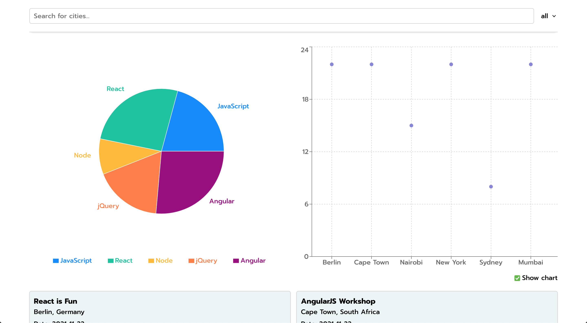
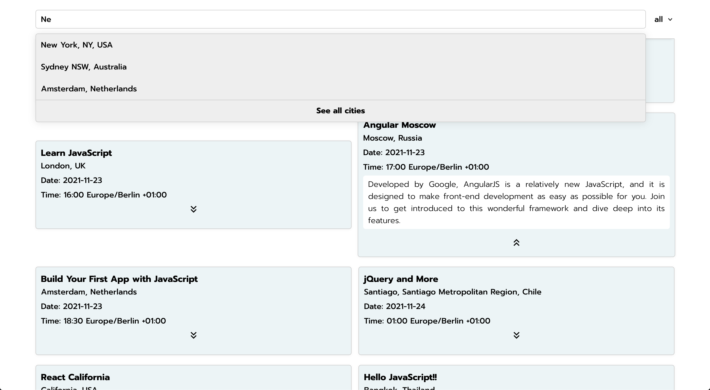

# Meet

This is a serverless PWA that provides information on coding events in a specific town taken from a fictitious Google event calendar. All data is visualized with two beautiful, clickable charts. <b>This app won't alter any of your calendars nor take or read any information off your calendar.</b>

<a href="https://hannesdonel.github.io/Meet/">Try the app in action.</a>

## Technologies

- HTML, CSS, JavaScript
- React
- Google Calendar API inlc. OAuth2 authentication flow
- AWS Lambda
- Serverless
- Recharts
- axios

I tracked the apps performance with <b>Atatus</b>. 
The app passes <a href="https://developers.google.com/web/tools/lighthouse/">Lighthouse’s PWA checklist.<a>

## Functionality

- Filter events by city
- Show/hide event details
- Specify number of events
- Use the app when offline
- Add an app shortcut to the home screen
- View a chart showing the number of upcoming events by city
- Charts can be hidden
- Charts are fully responsive and clickable to filter through events

## Get started

I'm using npm throughout this tutorial, you can of course use another package manager.

#### Run the app
- First of all run:

        npm install

- Start local server:

        npm start

- The app is now reachable on http://localhost:3000/ using mockData